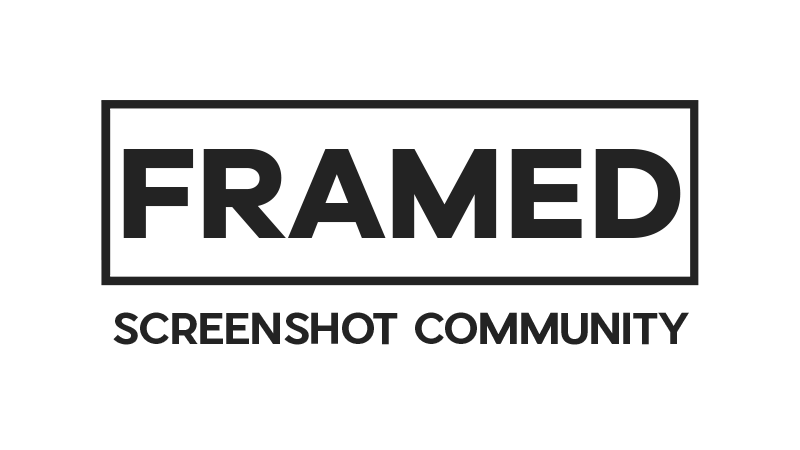

# ✨ About us

The [Framed website](https://framedsc.com) is an open-collaboration project, written and maintained by a community of volunteers from the Framed Screenshot Community. Used to document the terminology, methods, and tools surrounding virtual photography (and often creating them ourselves).

We welcome anyone willing to contribute their knowledge and expertise on anything relevant, be it to our game guides, a cool technique you know of, or anything you think could be useful to someone!

If you want to help out with the site by writing or maintaining guides head over to the [contribute guide](https://framedsc.com/contribute.htm). Also please feel free to reach out to any of the moderators listed on [the homepage](https://framedsc.com).

# 🚀 Projects

We are lucky to have so many amazing screenshoters and engineers, that's why we have several projects in which we display the mindblowing talent of our community. Feel free to check them out, and to collaborate if you want to as well!

  
  
  

